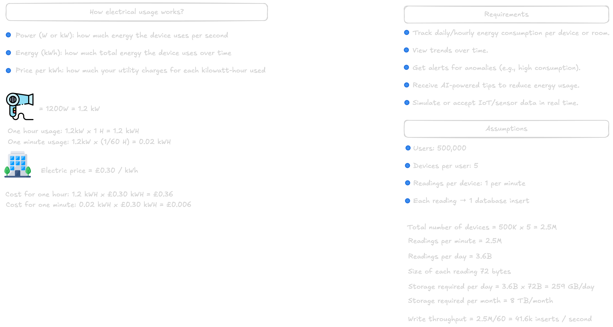
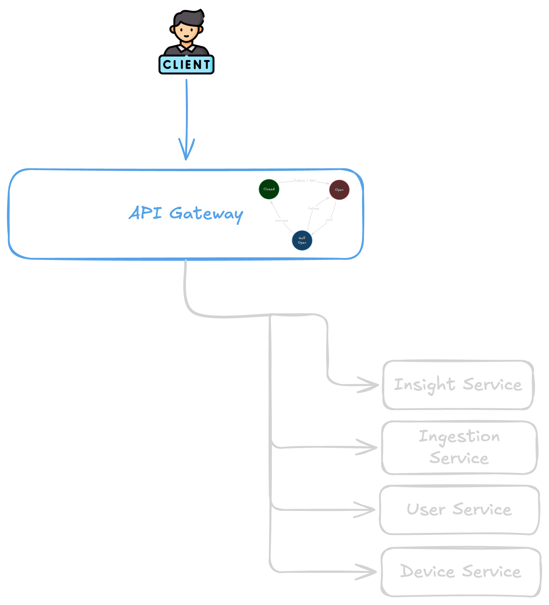
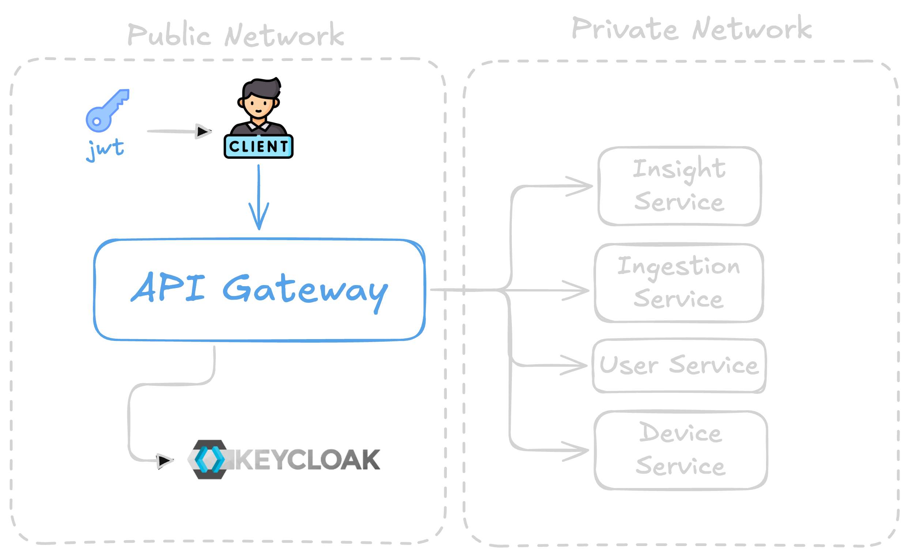
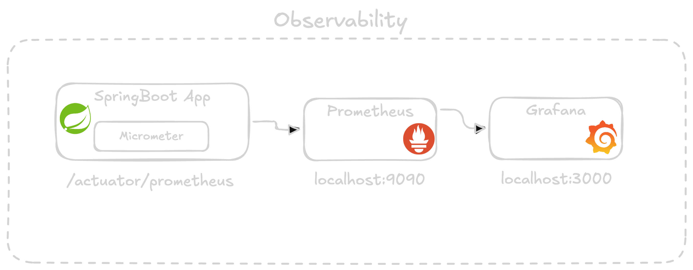

# Home Energy Tracker

[](https://openjdk.org/)
[](https://spring.io/projects/spring-boot)
[](https://spring.io/projects/spring-cloud)
[](https://docs.docker.com/compose/)
[]()

A **microservices reference implementation** for monitoring and reasoning about household electricity usage. The system accepts energy readings from devices, processes them asynchronously, stores time-series metrics, raises alerts when usage spikes, and exposes a unified API through an **API Gateway** with **resilience**, **security**, and **observability** built in.

---

## About this fork

> **Attribution:** This repository is a fork of [**leetjourney/home-energy-tracker**](https://github.com/leetjourney/home-energy-tracker), used with the original author's permission for **educational purposes**. All credit for the core microservices design, the Spring Boot implementation, and the accompanying video walkthrough belongs to **leetjourney** — see [Learning resources](#learning-resources).

I forked this project to practice **DevOps** on top of an already realistic, multi-service application instead of a toy example. It's a good learning target because:

- It's a genuine **microservices system** (7 services) with real inter-service dependencies (Kafka, MySQL, InfluxDB), not a single "hello world" app — so infrastructure and deployment decisions actually matter.
- It already ships with **observability** (Prometheus/Grafana), **security** (Keycloak/OAuth2), and **resilience** (circuit breakers) wired into the application layer, giving infrastructure work real signals to hook into (metrics endpoints, health checks, ports to expose or restrict).
- It's fully **containerized** via Docker Compose, which is a natural stepping stone toward provisioning it on real cloud infrastructure.

### What I added on top (DevOps focus)

The application code, the Compose stack, and the observability wiring are leetjourney's original work. On top of that, I added:

- **`Terraform/`** — Infrastructure as Code to provision the stack on **AWS**:
  - `main.tf` — an EC2 instance (latest Ubuntu AMI, `t3.small`, 30 GB `gp3` root volume) with a `user_data` bootstrap script that installs **Docker** and the **Docker Compose plugin** on first boot, so the existing `docker-compose.yml` can run unmodified on the instance.
  - A dedicated **security group** exposing only what's needed: SSH (22) and the observability/admin ports (Grafana 3000, Prometheus 9090, Kafka UI 8070, Mailpit 8025, Keycloak 8091) restricted to my own IP, with only the **API Gateway** (9000) open publicly — a basic least-privilege network boundary instead of opening everything.
  - An `aws_key_pair` resource wired to a local SSH public key, and a `data "aws_ami"` lookup so the instance always boots the latest Ubuntu image instead of a hardcoded, staleness-prone AMI ID.
  - `variable.tf` / `terraform.tfvars` — parameterized region (`eu-west-3` by default), instance type, and the operator's IP/CIDR, so the same configuration is reusable without editing `main.tf`.
  - `outputs.tf` — exposes the instance's public IP, instance ID, and a ready-to-use `ssh` command after `terraform apply`.

The practical exercise here is turning a "runs on my machine via Compose" project into something provisioned, reproducible, and deployable to a real cloud environment with `terraform init/plan/apply`, without having to touch the application code.

---

## Project overview

**Home Energy Tracker** models how a real product might collect **power (watts)** and **timestamps** from smart plugs or meters, aggregate that data for dashboards and billing-style views, and notify residents when consumption crosses thresholds.

**Problem it solves:** Raw device events are high-volume and need reliable ingestion, decoupled processing, and specialized storage (relational metadata vs. time-series measurements). This project demonstrates that split: HTTP APIs for users and devices, Kafka for event streaming, InfluxDB for usage series, and MySQL for durable domain data.

**Typical use cases:**

- Track **per-device** energy usage over time  
- **Alert** when instantaneous or aggregated power exceeds a limit  
- **Gate** all public HTTP traffic through one entry point (API Gateway) with JWT validation  
- **Observe** latency, errors, and circuit-breaker state with Prometheus and Grafana  

---

## Architecture overview

The system is a **microservices architecture** built primarily with **Spring Boot 4** and **Java 21**. Services are independently deployable modules; integration uses **synchronous HTTP** (client → gateway → service) and **asynchronous messaging** (Kafka) where loose coupling and scale matter.

**Patterns and capabilities:**

| Area | Approach |
|------|----------|
| **API Gateway** | Spring Cloud Gateway (Server MVC); single public HTTP façade, route aggregation, OpenAPI aggregation |
| **Service communication** | REST between gateway and backends; Kafka for ingestion → usage → alerts |
| **Resilience** | **Circuit breakers** (Resilience4j) on gateway routes with fallbacks |
| **Security** | **OAuth2 Resource Server** on the gateway; **Keycloak** for identity (dev profile in Docker Compose) |
| **Observability** | Spring Boot **Actuator**, **Micrometer**, **Prometheus** scrape targets, **Grafana** dashboards |
| **Configuration** | Per-service `application.properties` (no separate Spring Cloud Config Server in this repo) |

**High-level interaction:** Clients call the **API Gateway**. Domain services (**user**, **device**, **ingestion**, **insight**) sit behind it. **Ingestion** publishes to Kafka; **usage** consumes, writes to **InfluxDB**, and may publish **alerts**; **alert** consumes alerts and sends email (e.g. via **Mailpit** in local dev). **Insight** can provide AI-style summaries (Spring AI), routed through the gateway when enabled.

---

## Services breakdown

| Service | Port | Responsibility | Key technologies | Interactions |
|---------|------|------------------|------------------|--------------|
| **api-gateway** | `9000` | Public entry: routing, circuit breaking, JWT validation, aggregated API docs | Spring Boot 4, Spring Cloud Gateway (WebMVC), Resilience4j, OAuth2 Resource Server, springdoc | Proxies to user, device, ingestion, insight services; calls Keycloak JWKS |
| **user-service** | `8080` | User accounts and related persistence | Spring Boot 4, JPA, MySQL, Flyway, Actuator/Prometheus | MySQL; invoked via gateway |
| **device-service** | `8081` | Device registry / metadata | Spring Boot 4, JPA, MySQL, Actuator/Prometheus | MySQL; invoked via gateway |
| **ingestion-service** | `8082` | Accept energy readings over HTTP and publish to streaming pipeline | Spring Boot 4, Kafka producer, Actuator/Prometheus | Produces to Kafka (`energy-usage`); invoked via gateway or directly for tests |
| **usage-service** | `8083` | Consume usage events, time-series storage, aggregation / threshold logic | Spring Boot 4, Kafka consumer/producer, InfluxDB Java client, Actuator/Prometheus | Kafka ↔ InfluxDB; produces alert events for downstream consumers |
| **alert-service** | `8084` | Consume alert events, notify users (e.g. email) | Spring Boot 4, Kafka, JPA, Mail, MySQL, Actuator/Prometheus | Kafka consumer; SMTP (Mailpit locally); MySQL where applicable |
| **insight-service** | `8085` | Usage insights (e.g. LLM-backed explanations via Ollama) | Spring Boot 3.5, Spring AI, Ollama starter, Actuator/Prometheus | Invoked via gateway; optional external Ollama runtime |

> **Note:** Most services target **Spring Boot 4**; `insight-service` uses **Spring Boot 3.5** with **Spring AI** for model integration. There is **no** Spring Cloud Config Server or Kubernetes manifests in this repository—Compose is the primary local orchestration path.

---

## System flow and diagrams

### Background and requirements

*Electricity basics, assumptions, and what the system must support (sources, units, constraints).*

  
*Figure: Background and requirements for the Home Energy Tracker domain.*

---

### Circuit breaker in the API Gateway

*When downstream services fail or slow down, the gateway stops hammering them: the **circuit breaker** opens, short-circuits calls, and can return a controlled fallback—improving stability for the whole system.*

  
*Figure: Resilience and circuit breaker behavior at the edge (API Gateway).*

---

### Gateway in the public network

*The **API Gateway** sits in a **public** or DMZ-style network segment while core services run in a more **private** zone. Clients never talk to every microservice directly; they use one controlled entry point.*

  
*Figure: Public vs private network separation with the gateway as the controlled entry point.*

---

### Full microservices flow

*End-to-end path: ingestion, messaging, usage processing, storage, alerting, and supporting services.*

  
*Figure: Full system walkthrough across components and data paths.*

---

### Observability with Prometheus and Grafana

*Services expose **Prometheus**-compatible metrics via Actuator. **Prometheus** scrapes and stores series; **Grafana** visualizes SLO-friendly dashboards (latency, errors, JVM, circuit breaker health).*

  
*Figure: Monitoring and observability stack (metrics flow and tooling).*

---

## Tech stack

- **Language:** Java **21**  
- **Framework:** **Spring Boot 4** (domain services and gateway); **Spring Boot 3.5** + **Spring AI** (`insight-service`)  
- **Spring Cloud:** **2025.1.0** — Gateway (Server WebMVC), **Circuit Breaker** (Resilience4j)  
- **Messaging:** **Apache Kafka** (KRaft)  
- **Databases:** **MySQL 8** (relational data), **InfluxDB 2** (time-series usage)  
- **Identity (local dev):** **Keycloak**  
- **Email (local dev):** **Mailpit**  
- **Observability:** **Micrometer**, **Prometheus**, **Grafana**  
- **API documentation:** **springdoc-openapi** (gateway aggregates service OpenAPI URLs)  
- **Containerization:** **Docker** & **Docker Compose**  
- **Build:** **Maven** (each service includes `mvnw`)  

Kubernetes is **not** part of this repo; deploying to K8s would be a natural extension (Helm charts, ConfigMaps, service mesh, etc.).

---

## Getting started

### Prerequisites

- **JDK 21**  
- **Docker** and **Docker Compose**  
- **Maven** (optional if you use `./mvnw` in each service)  

### Clone the repository

```bash
git clone git@github.com:leetjourney/home-energy-tracker.git
cd home-energy-tracker
```

### Start infrastructure

From the **repository root**:

```bash
docker compose -v up -d
```

This brings up **MySQL**, **Kafka**, **Kafka UI**, **InfluxDB**, **Mailpit**, **Keycloak** (+ DB), **Prometheus**, and **Grafana**.

Stop everything:

```bash
docker compose down
```

If databases fail to initialize, remove volumes or re-run `docker/mysql/init.sql` as described in `AGENTS.md`.

### Build services

Each microservice is its own Maven project:

```bash
cd user-service && ./mvnw -q package && cd ..
# Repeat for: device-service, ingestion-service, usage-service, alert-service, insight-service, api-gateway
```

Or run with:

```bash
./mvnw spring-boot:run
```

### Run applications

1. Ensure Docker Compose is running (Kafka, MySQL, InfluxDB, etc.).  
2. Start services on the **host** on their default ports (see table above)—or containerize them yourself.  
3. For **Kafka from the host**, bootstrap is typically **`localhost:9094`** (external listener in Compose).  

**Prometheus** in this repo is configured to scrape **`host.docker.internal`** for Actuator endpoints—so metrics work when Spring Boot apps run on the **host** while Prometheus runs in Docker.

### Quick pipeline test

Post a sample reading to ingestion (direct to service or via gateway if routed):

```bash
curl -X POST http://localhost:8082/api/v1/ingestion \
  -H 'Content-Type: application/json' \
  -d '{"deviceId":"dev-1","timestamp":"2025-01-01T12:00:00Z","watts":1200}'
```

Then check **usage-service** logs, **InfluxDB**, **Kafka UI** (`http://localhost:8070`), and **Mailpit** (`http://localhost:8025`) after threshold/alert logic runs.

### Access points (local defaults)

| What | URL |
|------|-----|
| **API Gateway** | http://localhost:9000 |
| **Grafana** | http://localhost:3000 (admin / admin) |
| **Prometheus** | http://localhost:9090 |
| **Kafka UI** | http://localhost:8070 |
| **Mailpit** | http://localhost:8025 |
| **Keycloak** | http://localhost:8091 |
| **InfluxDB UI** | http://localhost:8072 |

Service-specific OpenAPI is linked from the gateway’s Swagger UI configuration (`/swagger-ui.html`).

---

## Observability

- Each Spring Boot app exposes **`/actuator/prometheus`** (enabled via dependencies and management config).  
- **Prometheus** (`docker/prometheus/prometheus.yml`) defines scrape jobs for the gateway and all services on the host.  
- **Grafana** loads provisioning from `docker/grafana/provisioning` and uses Prometheus as a data source.  
- **Circuit breaker** state can be surfaced through Actuator health where enabled (see gateway `application.properties`).  

Use Grafana for dashboards and Prometheus for ad-hoc queries and alerting rules as you extend the deployment.

---

## Future improvements

- **End-to-end tests** — Contract or black-box tests across gateway → services → Kafka → DB  
- **CI/CD** — Build matrix per service, image publish, Compose or K8s smoke tests  
- **Frontend dashboard** — SPA for devices, live usage charts, alert history  
- **AuthZ hardening** — Fine-grained scopes, service-to-service tokens, policy engine  
- **Kubernetes** — Helm charts, external secrets, HPA, and Kafka/Influx operators  
- **Centralized config** — Spring Cloud Config or external secret stores for non-dev environments  

---

## Learning resources

### YouTube playlist

Step-by-step build and concepts for this style of system:  
[https://www.youtube.com/playlist?list=PLJce2FcDFtxL94MVNXRzIM0WR2qNyz5i_](https://www.youtube.com/playlist?list=PLJce2FcDFtxL94MVNXRzIM0WR2qNyz5i_)

### Support the project

[https://buymeacoffee.com/leetjourney](https://buymeacoffee.com/leetjourney)

---

## Additional documentation

- **[AGENTS.md](AGENTS.md)** — Quick runbook for AI agents and operators (ports, topics, curl examples).  
- Per-service **`HELP.md`** — Module-specific notes where present.  

---

*Home Energy Tracker — a portfolio-grade Spring microservices example for learning production-style patterns without oversimplifying the moving parts.*
